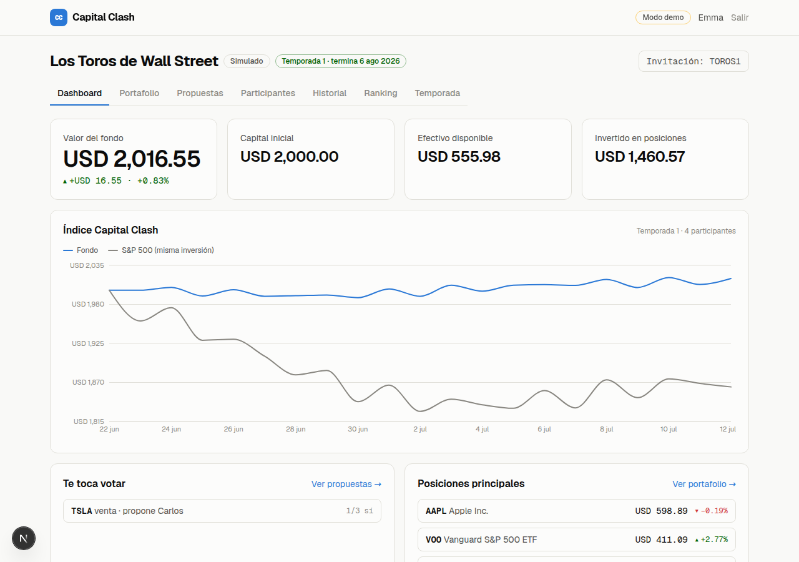

# ⚔️ Capital Clash

**El juego de estrategia financiera para invertir en equipo.** Un grupo de
amigos forma un fondo de inversión común: proponen acciones reales, votan cada
decisión y compiten por el mejor rendimiento en temporadas de ~45 días.



## ¿Cómo se juega?

1. **Formen su fondo** — crea un grupo, comparte el código de invitación y
   acuerden la aportación por persona.
2. **Propongan y voten** — cada inversión se propone con una tesis y necesita
   mayoría de votos "sí" para ejecutarse. Las propuestas expiran a las 48 h.
3. **Compitan y aprendan** — sigan el valor del fondo contra el S&P 500. Al
   cierre se liquidan las posiciones, se calcula el rendimiento y se publica
   el ranking.

### Dos modos de juego (por grupo)

| Modo | Qué significa |
|---|---|
| **Simulado** | Capital virtual. Las operaciones aprobadas se ejecutan solas al precio de mercado. Ideal para aprender sin riesgo. |
| **Dinero real** | La app es el registro y marcador del grupo; el dinero vive en el broker que ustedes usen. Al aprobarse una propuesta, el administrador ejecuta la orden en el broker y registra el precio real. |

### Ranking individual

Como el fondo es común, la puntuación personal se calcula así: el rendimiento
ponderado de las **compras que tú propusiste** y el grupo ejecutó, más un bono
acotado por **puntería al votar** (votar sí a inversiones ganadoras y no a
perdedoras). El dashboard también compara el fondo completo contra el S&P 500
(el **Índice Capital Clash**).

## Correr el proyecto

```bash
npm install
npm run dev
```

Abre <http://localhost:3000>. **Sin configurar nada, la app corre en modo
demo**: un grupo de ejemplo con 4 jugadores, portafolio, propuestas en
votación e historial. En `/login` eliges con qué jugador entrar — sal y entra
como otro jugador para simular la votación completa.

> Los datos demo viven en memoria y se reinician al reiniciar el servidor.

## Conectar Supabase (cuentas y datos reales)

1. Crea un proyecto gratis en [supabase.com](https://supabase.com).
2. En el **SQL Editor** pega y ejecuta el contenido completo de
   [`supabase/schema.sql`](supabase/schema.sql) (tablas, políticas de
   seguridad RLS, funciones y trigger de perfiles).
3. Copia `.env.example` a `.env.local` y llena, desde
   **Settings → API** de tu proyecto:
   ```
   NEXT_PUBLIC_SUPABASE_URL=https://xxxx.supabase.co
   NEXT_PUBLIC_SUPABASE_ANON_KEY=eyJ...
   ```
4. Reinicia `npm run dev`. La app deja el modo demo automáticamente: registro
   e inicio de sesión reales, grupos con códigos de invitación y datos
   persistentes con seguridad a nivel de fila (cada quien solo ve sus grupos).

## Precios reales de acciones (Financial Modeling Prep)

Sin API key la app usa precios demo deterministas. Para cotizaciones reales:

1. Crea una key gratuita en
   [financialmodelingprep.com](https://site.financialmodelingprep.com/developer/docs).
2. Agrégala a `.env.local`:
   ```
   FMP_API_KEY=tu_key
   ```

Las cotizaciones se consultan solo en el servidor con caché de 15 minutos
(suficiente para el juego y para el plan gratuito). Si FMP falla, la app
degrada a precios demo en lugar de romperse.

## Desplegar en Vercel

1. Sube el repo a GitHub y conéctalo en [vercel.com](https://vercel.com) →
   **New Project** (framework: Next.js, sin configuración extra).
2. En **Settings → Environment Variables** agrega las tres variables de
   `.env.example`.
3. En Supabase, agrega tu dominio de Vercel en
   **Authentication → URL Configuration** (Site URL).

## Stack técnico

- **Next.js 15** (App Router, Server Components y Server Actions) + TypeScript
- **Tailwind CSS 4** con tokens de diseño propios (modo claro y oscuro)
- **Recharts** para el Índice Capital Clash
- **Supabase** (Postgres + Auth + RLS) — con capa de datos intercambiable:
  `lib/data/demo.ts` (memoria) y `lib/data/supabase.ts` comparten la interfaz
  `DataProvider`, y las reglas del juego viven una sola vez en `lib/game.ts`.

```
app/            páginas (App Router) y server actions
  g/[id]/       dashboard, portafolio, propuestas, participantes,
                historial, ranking, temporada
lib/
  game.ts       reglas: mayorías, ejecución, cierre de temporada, snapshots
  portfolio.ts  cálculos: posiciones, rendimientos, ranking, estadísticas
  prices.ts     precios FMP + precios demo deterministas
  data/         DataProvider (demo | supabase)
supabase/       schema.sql listo para pegar en el SQL Editor
design/         brief de diseño y capturas actuales
```

## Roadmap (visión a futuro)

- Ligas con varias temporadas y tabla histórica entre grupos
- Insignias y logros (mejor ojo, francotirador de votos, rey del rally…)
- Perfiles públicos y comparativas entre grupos
- Notificaciones (te toca votar, propuesta aprobada, cierre de temporada)
- Análisis asistido por IA de las tesis de inversión
- App móvil

---

⚠️ Capital Clash es un juego educativo entre amigos. No es asesoría
financiera, no custodia dinero y no ejecuta órdenes en ningún mercado.
